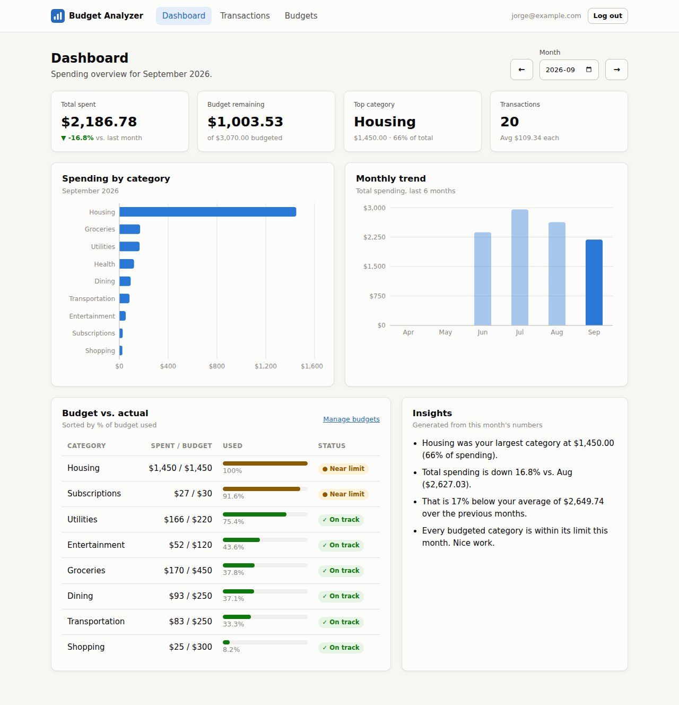

# Budget Analyzer

A personal finance analytics web app. Track your expenses, set monthly budgets for each category, and use a dashboard to see where your money goes. The dashboard shows KPIs, trends, budget-vs-actual variance and auto-generated insights.

**Live app:** https://budget-analyzer-jorge.netlify.app
**Demo video:** https://youtu.be/axVhp40muIc



## What the app does

1. **Create an account** and log in. Each user's data is private to them.
2. **Record expenses.** Add them one at a time, or import a bank-style CSV file.
3. **Set a monthly budget** for each spending category.
4. **Analyze** spending on the dashboard:
   - KPI tiles: total spent with month-over-month change, budget remaining, top category, and transaction count with average size
   - A spending-by-category chart and a 6-month trend chart
   - A budget vs. actual table with % used and status (on track / near limit / over budget)
   - Plain-English insights generated from the month's numbers

### Business questions this answers

| Question | Where it's answered |
|---|---|
| Where is most of my money going? | Spending by category chart, Top category KPI |
| Am I spending more or less than last month? | Total spent KPI (MoM % change), Monthly trend chart |
| How does this month compare to my usual spending? | Insights (vs. the average of previous months) |
| Which categories are over budget, and by how much? | Budget vs. actual table, Insights |
| How much can I still spend this month? | Budget remaining KPI, Budgets page |

## Features

- **Authentication:** register, log in and log out with Supabase Auth. All pages except login require a signed-in user.
- **Full CRUD:**
  - Transactions: create, read, update and delete
  - Budgets: create, read, update and delete, plus copying last month's budgets into the current month
- **Filtering:** by month and category, plus merchant search, all done in the database query.
- **CSV import:** handles common bank headers (`Transaction Date`, `Description`, `Debit`…) and cleans the data:
  - normalizes dates (`09/14/2026` → `2026-09-14`)
  - strips `$` and commas from amounts and converts negative amounts to positive
  - maps unknown categories to `Other`
  - skips and counts invalid rows
- **CSV export:** downloads the currently filtered transactions.
- **SQL analytics views:** aggregation happens in PostgreSQL, not in the browser.
- **Row Level Security:** every query is restricted to the logged-in user's own rows.
- Light and dark mode, and a responsive layout that works on phones.

## Technologies used

| Layer | Technology |
|---|---|
| Frontend | React 19, Vite, React Router |
| Charts | Recharts |
| CSV parsing | Papa Parse |
| Backend / database | Supabase (PostgreSQL, Auth, Row Level Security) |
| Hosting | Netlify |
| Development | Built with AI tooling (Claude Code); Git + GitHub |

## Database design

The full schema is in [`supabase/schema.sql`](supabase/schema.sql).

**Tables**
- `transactions` has these columns: `id`, `user_id`, `txn_date`, `amount`, `merchant`, `category`, `notes`, `created_at`
- `budgets` has these columns: `id`, `user_id`, `category`, `month`, `amount`
  - It has a unique key on `(user_id, category, month)`, so there is only one budget per category per month.

**Analytics views** (`security_invoker`, so RLS still applies)
- `monthly_category_spending` totals spending and counts transactions per user, month and category.
- `budget_vs_actual` joins budgets to actual spending and calculates `remaining` and `pct_used`.

```sql
-- Example: the budget_vs_actual view
select b.category, b.amount as budgeted,
       coalesce(s.total_spent, 0) as actual,
       b.amount - coalesce(s.total_spent, 0) as remaining,
       round(coalesce(s.total_spent, 0) / b.amount * 100, 1) as pct_used
from budgets b
left join monthly_category_spending s
  on s.user_id = b.user_id and s.month = b.month and s.category = b.category;
```

**Security:** Row Level Security policies allow a user to select, insert, update or delete a row only when `auth.uid() = user_id`.

## Project structure

```
budget-analyzer/
├── public/
│   ├── favicon.svg
│   └── sample-transactions.csv   # 4 months of demo data to import
├── src/
│   ├── main.jsx                  # App entry: router + auth provider
│   ├── App.jsx                   # Route table (protected vs. public routes)
│   ├── index.css                 # Global styles, light/dark theme tokens
│   ├── context/AuthContext.jsx   # Session state + signUp / signIn / signOut
│   ├── components/
│   │   ├── Layout.jsx            # Top nav + logout
│   │   ├── ProtectedRoute.jsx    # Redirects signed-out users to /login
│   │   ├── TransactionForm.jsx   # Add / edit form
│   │   └── BudgetStatus.jsx      # Progress bar + status badge logic
│   ├── lib/
│   │   ├── supabaseClient.js     # Supabase client from env variables
│   │   ├── csv.js                # CSV import (cleaning) and export
│   │   └── format.js             # Categories, currency and month helpers
│   └── pages/
│       ├── AuthPage.jsx          # Login + registration
│       ├── DashboardPage.jsx     # KPIs, charts, budget table, insights
│       ├── TransactionsPage.jsx  # CRUD, filters, CSV import/export
│       └── BudgetsPage.jsx       # Budget CRUD + budget vs. actual
├── supabase/schema.sql           # Tables, RLS policies, analytics views
└── netlify.toml                  # Build settings + SPA redirect
```

## Setup instructions

**Prerequisites:** Node.js 20+ and a free [Supabase](https://supabase.com) account.

1. **Clone and install**
   ```bash
   git clone https://github.com/jorgefau/budget-analyzer.git
   cd budget-analyzer
   npm install
   ```
2. **Create the database.** In a new Supabase project, open **SQL Editor**, paste in the contents of `supabase/schema.sql`, and run it.
3. **(Optional) Allow instant sign-in.** Under **Authentication → Sign In / Providers → Email**, turn off **Confirm email** so new accounts can log in without clicking a confirmation email.
4. **Add your keys.** Copy `.env.example` to `.env.local` and fill in the values from **Project Settings → API Keys**:
   ```
   VITE_SUPABASE_URL=https://your-project-ref.supabase.co
   VITE_SUPABASE_PUBLISHABLE_KEY=your-publishable-or-anon-key
   ```
   Only use the publishable/anon key. Never put the secret/service_role key in a frontend app.
5. **Run it**
   ```bash
   npm run dev
   ```
   Open http://localhost:5173, create an account, then go to **Transactions → Import CSV** and choose `public/sample-transactions.csv` to load demo data.

### Deploying to Netlify

1. In Netlify, choose **Add new project → Import an existing project → GitHub** and pick this repo. `netlify.toml` already sets the build command (`npm run build`) and publish folder (`dist`).
2. Under **Site configuration → Environment variables**, add `VITE_SUPABASE_URL` and `VITE_SUPABASE_PUBLISHABLE_KEY`.
3. Deploy. The redirect rule in `netlify.toml` makes page refreshes on routes like `/budgets` work.

## CSV format

The simplest format is the one the app exports:

```csv
date,amount,merchant,category,notes
2026-09-01,1450.00,Palm Grove Apartments,Housing,Rent
2026-09-04,53.69,Walmart,Groceries,
```

The app also accepts bank exports with columns like `Transaction Date`, `Description` and `Amount`. The import treats every row as an expense, so remove income or credit rows first.

**Categories:** Housing, Groceries, Dining, Transportation, Utilities, Subscriptions, Shopping, Entertainment, Health, Other

## Possible future improvements

- Income tracking and savings rate
- Recurring transaction detection
- Rule-based auto-categorization of imported merchants
- Custom date ranges and year-over-year comparison
